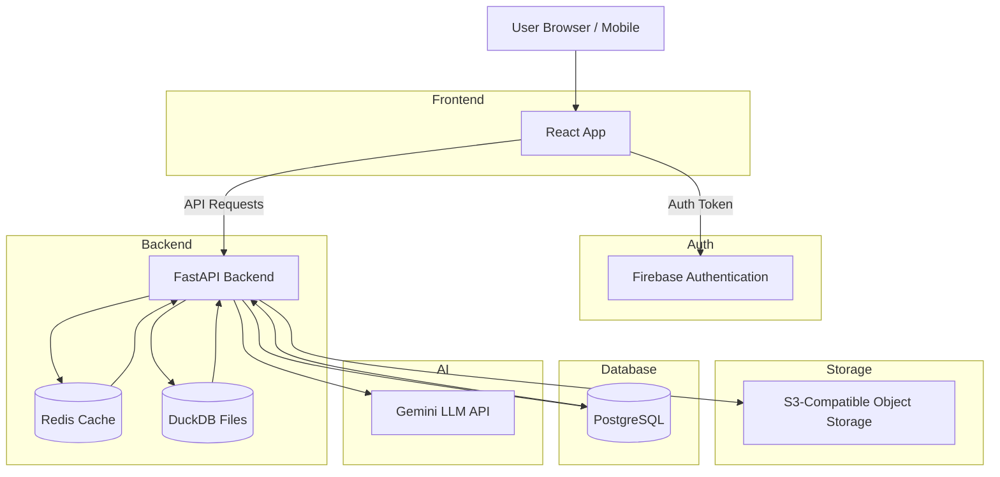
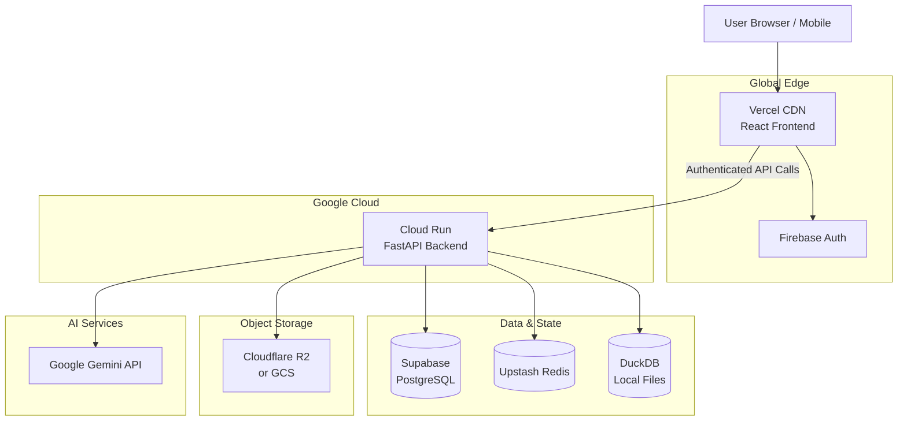

# AI BI Analytics - Frontend Client

A modern, AI-powered Business Intelligence analytics platform built with React and TypeScript. Transform your data into actionable insights through natural language conversations.


## Features

- **🤖 AI-Powered Analytics** - Ask questions about your data in natural language
- **📊 Interactive Visualizations** - Dynamic charts (Bar, Line, Pie) and data tables
- **📁 Multi-Workspace Support** - Organize datasets across multiple workspaces
- **🔐 Secure Authentication** - Firebase-based Google Sign-In
- **📱 Responsive Design** - Optimized for desktop and mobile devices
- **💬 Chat Sessions** - Save and manage conversation history
- **📈 Usage Tracking** - Monitor API usage and plan limits
- **🎨 Modern UI** - Beautiful, accessible interface with smooth animations

## Tech Stack

- **Framework**: React 19 with TypeScript
- **Build Tool**: Vite 7.3
- **Styling**: Tailwind CSS 4.0
- **Authentication**: Firebase Auth
- **State Management**: React Context API
- **Routing**: React Router v7
- **Charts**: Custom chart components
- **HTTP Client**: Custom API client with token refresh

## Project Structure

```
src/
├── components/
│   ├── chat/                    # Chat & visualization components
│   │   ├── charts/              # Chart components (Bar, Line, Pie, DataTable)
│   │   ├── ChartVisualization   # Main chart visualization wrapper
│   │   ├── ChatMessage          # Chat message bubbles
│   │   └── SessionList          # Chat session sidebar
│   │
│   ├── common/                  # Reusable UI components
│   │   ├── ActionSheet          # Mobile action sheet
│   │   ├── ConfirmDialog        # Confirmation modal
│   │   └── ContextMenu          # Right-click context menu
│   │
│   ├── layout/                  # Layout components
│   │   ├── MainLayout           # Main app layout wrapper
│   │   ├── TopNav               # Top navigation bar
│   │   ├── SideMenu             # Desktop sidebar
│   │   ├── BottomNav            # Mobile bottom navigation
│   │   ├── WorkspaceSwitcher    # Workspace dropdown
│   │   ├── DatasourceModal      # Add/Edit dataset modal
│   │   └── UploadModal          # File upload progress modal
│   │
│   ├── settings/                # Settings page sections
│   │   ├── GeneralSection       # Profile & preferences
│   │   ├── SecuritySection      # 2FA & authentication
│   │   ├── NotificationsSection # Notification preferences
│   │   ├── UsageSection         # Usage & billing
│   │   ├── HelpSection          # Help & support
│   │   └── AboutSection         # App info & legal
│   │
│   ├── profile/                 # Profile page components
│   ├── usage/                   # Usage warning banners
│   └── workspace/               # Workspace components
│
├── context/                     # React Context providers
│   ├── AuthContext              # Authentication state
│   ├── WorkspaceContext         # Workspace & datasource state
│   ├── ChatSessionContext       # Chat session management
│   ├── DatasourceContext        # Datasource operations
│   └── UsageContext             # Usage tracking
│
├── pages/                       # Route page components
│   ├── SignIn / SignUp          # Authentication pages
│   ├── Workspace                # Main chat workspace
│   ├── WorkspacesPage           # Workspace management
│   ├── DatasetsPage             # Dataset management
│   ├── SessionsPage             # Chat history
│   ├── ProfilePage              # User profile
│   └── SettingsPage             # App settings
│
├── services/                    # API & external services
│   ├── apiClient                # HTTP client with auth
│   └── authService              # Firebase auth wrapper
│
├── types/                       # TypeScript type definitions
│   ├── api                      # API response types
│   ├── formatting               # Data formatting types
│   └── usage                    # Usage tracking types
│
├── utils/                       # Utility functions
│   ├── formatters               # Data formatting helpers
│   └── visualizationAdapter     # Chart data adapters
│
├── lib/
│   └── firebase                 # Firebase configuration
│
├── App.tsx                      # Main app with routing
├── main.tsx                     # App entry point
└── index.css                    # Global styles
```

## Getting Started

### Prerequisites

- Node.js 18+ or Bun
- Firebase project with Authentication enabled

### Installation

1. **Clone the repository**
   ```bash
   git clone <repository-url>
   cd frontend-client
   ```

2. **Install dependencies**
   ```bash
   bun install
   # or
   npm install
   ```

3. **Configure environment variables**
   
   Create a `.env` file in the root directory:
   ```env
   VITE_FIREBASE_API_KEY=your_api_key
   VITE_FIREBASE_AUTH_DOMAIN=your_project.firebaseapp.com
   VITE_FIREBASE_PROJECT_ID=your_project_id
   VITE_FIREBASE_STORAGE_BUCKET=your_project.appspot.com
   VITE_FIREBASE_MESSAGING_SENDER_ID=your_sender_id
   VITE_FIREBASE_APP_ID=your_app_id
   VITE_API_BASE_URL=http://localhost:8000
   ```

4. **Start the development server**
   ```bash
   bun run dev
   # or
   npm run dev
   ```

5. **Open in browser**
   
   Navigate to `http://localhost:5173`

## Available Scripts

| Command | Description |
|---------|-------------|
| `bun run dev` | Start development server with HMR |
| `bun run build` | Build for production |
| `bun run preview` | Preview production build locally |
| `bun run lint` | Run ESLint for code quality |

## Key Features Explained

### AI Chat Interface
The main workspace provides a conversational interface where users can:
- Ask natural language questions about their data
- Receive AI-generated insights and visualizations
- View data in interactive charts or tables
- Export visualizations as images

### Workspace Management
- Create multiple workspaces to organize different projects
- Each workspace can contain multiple datasets
- Switch between workspaces seamlessly

### Dataset Management
- Upload CSV, Excel, or JSON files
- Connect to external data sources
- Preview and manage dataset schemas

### Settings & Security
- Two-Factor Authentication (2FA) setup
- Notification preferences
- Usage monitoring and billing
- Profile management

## API Integration

The frontend communicates with a FastAPI backend through a custom API client that handles:
- Automatic token refresh
- Request/response interceptors
- Error handling and retries
- Multipart file uploads

## Browser Support

- Chrome (latest)
- Firefox (latest)
- Safari (latest)
- Edge (latest)

## Contributing

1. Fork the repository
2. Create a feature branch (`git checkout -b feature/amazing-feature`)
3. Commit your changes (`git commit -m 'Add amazing feature'`)
4. Push to the branch (`git push origin feature/amazing-feature`)
5. Open a Pull Request

## License

This project is proprietary software. All rights reserved.

---

## System Architecture



### Architecture Components

| Component | Technology | Purpose |
|-----------|------------|---------|
| **Frontend** | React + TypeScript | User interface and client-side logic |
| **Authentication** | Firebase Auth | Secure user authentication with Google SSO |
| **Backend API** | FastAPI (Python) | REST API, business logic, and data processing |
| **Cache** | Redis | Session caching and rate limiting |
| **Analytics DB** | DuckDB | Fast analytical queries on uploaded datasets |
| **Main Database** | PostgreSQL | User data, workspaces, and metadata storage |
| **Object Storage** | S3-Compatible | Dataset file storage |
| **AI/LLM** | Google Gemini | Natural language processing and query generation |


# Deployment Architecture 

